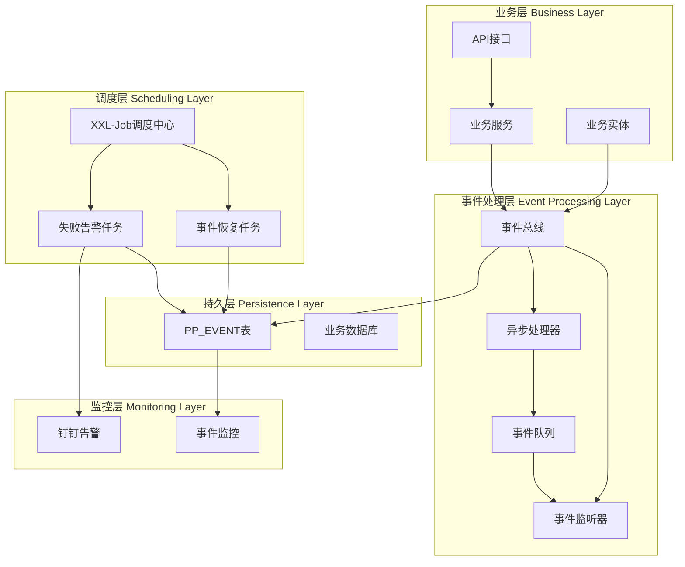
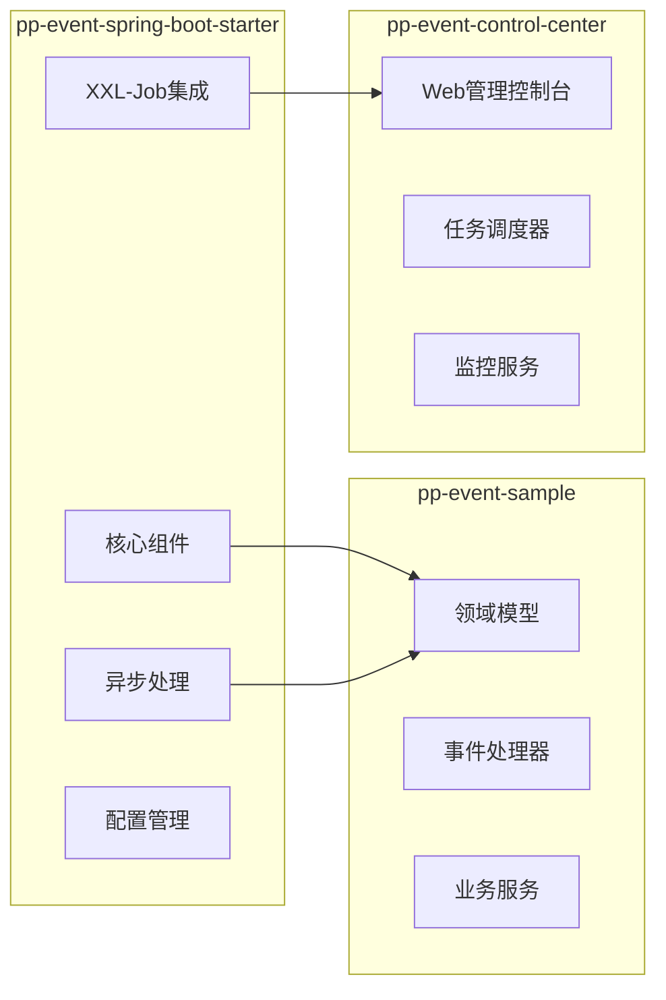
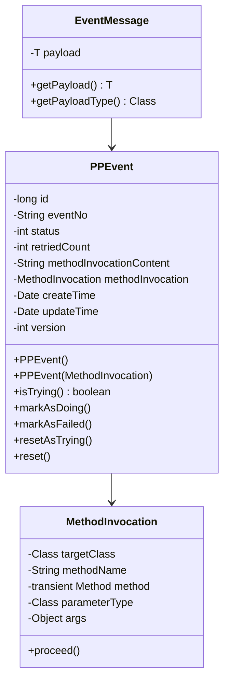
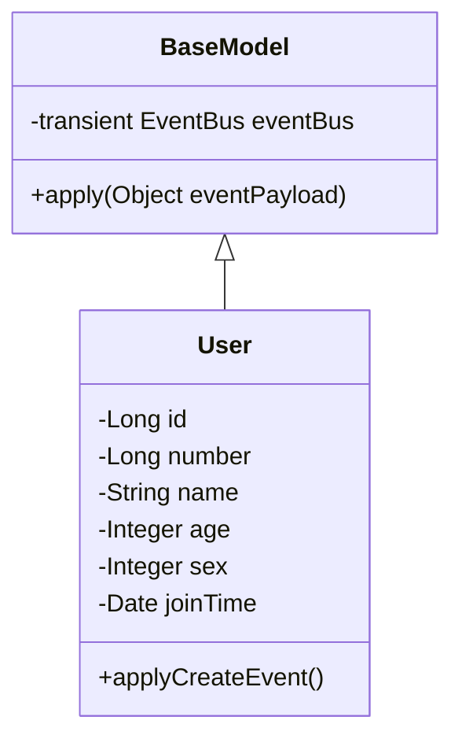
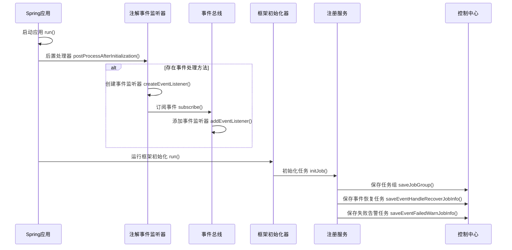
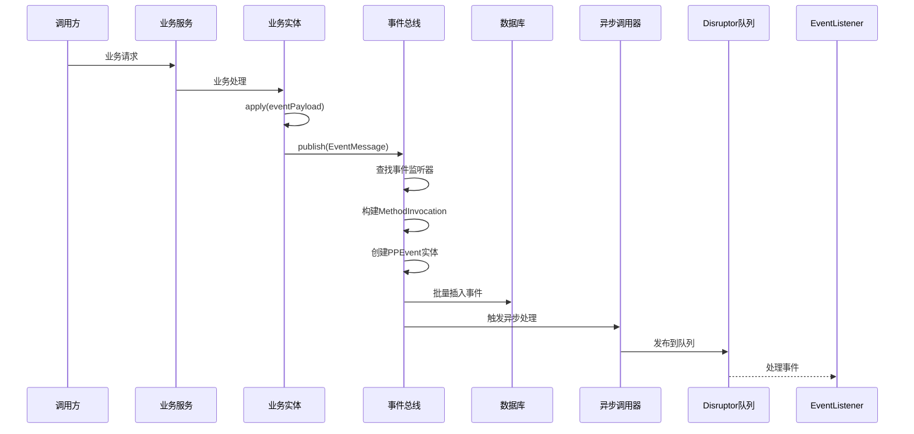
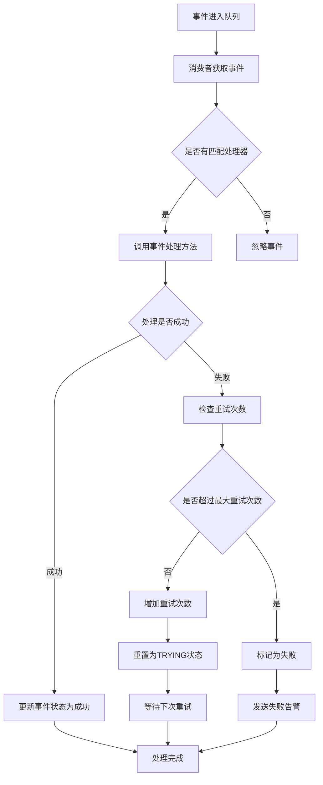
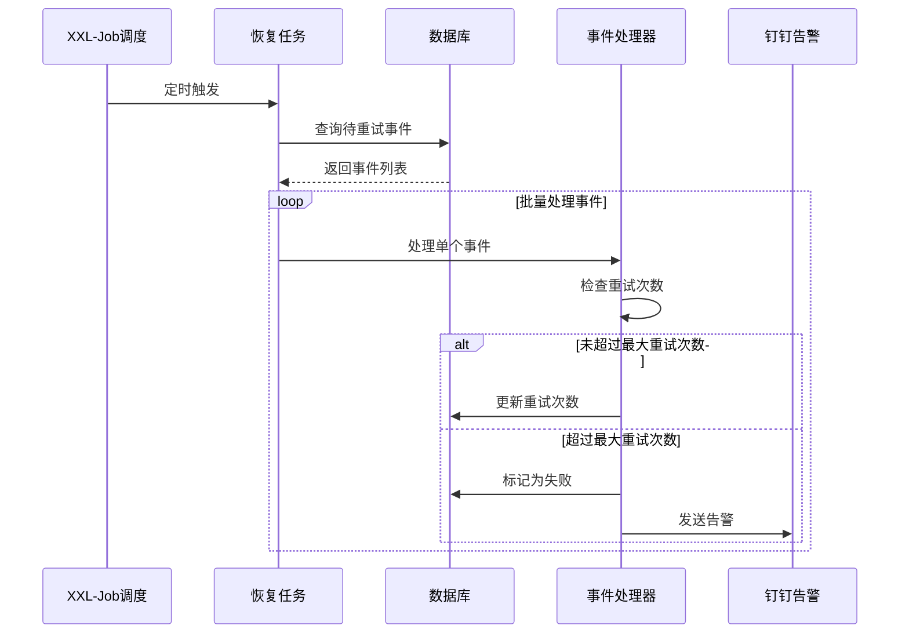
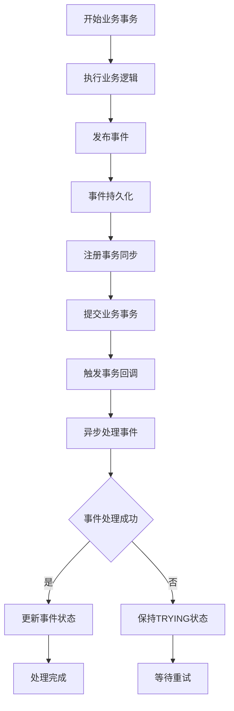

## 目录
1. [系统架构](#系统架构)
2. [数据模型](#数据模型)
3. [核心组件](#核心组件)
4. [业务流程](#业务流程)
5. [实现示例](#实现示例)
6. [设计要点分析](#设计要点分析)
7. [用户手册](#用户手册)
## 系统架构

### 整体架构概览

PP-Event是一个基于Spring Boot的异步事件框架，采用事件驱动架构（EDA）模式，支持高性能异步事件处理、失败重试机制和分布式任务调度。



### 核心架构特点

1. **事件驱动架构**：基于发布-订阅模式，实现业务逻辑与事件处理的解耦
2. **异步处理**：使用Disruptor高性能队列实现异步事件处理
3. **事务一致性**：事件发布与业务事务在同一事务中，保证数据一致性
4. **失败重试**：集成XXL-Job实现失败事件的自动重试机制
5. **监控告警**：支持钉钉告警，提供实时监控能力

### 模块架构



## 数据模型

### 核心实体模型

#### 1. PPEvent（事件实体）



#### 2. BaseModel（业务实体基类）



### 数据库设计

#### PP_EVENT事件表

| 字段名 | 类型 | 说明 | 索引 |
|--------|------|------|------|
| id | bigint(11) unsigned | 主键ID | PRIMARY |
| event_no | varchar(50) | 事件编号 | INDEX |
| status | int(11) | 事件状态 | INDEX |
| retried_count | int(11) | 重试次数 | INDEX |
| method_invocation_content | varchar(1000) | 方法调用内容 | - |
| create_time | datetime | 创建时间 | INDEX |
| update_time | datetime | 更新时间 | - |
| version | int(11) | 版本号 | - |

#### 事件状态枚举

```java
public enum PPEventStatus {
    TRYING(0,    "处理中"),
    DOING(1,     "执行中"),
    FAILED(2,    "失败");
}
```

#### XXL-Job相关表结构

主要包含：
- `xxl_job_info`: 任务信息表
- `xxl_job_log`: 任务日志表
- `xxl_job_group`: 执行器表
- `xxl_job_registry`: 注册信息表
- `xxl_job_user`: 用户表

## 核心组件

### 1. EventBus（事件总线）

**职责**：
- 事件发布的核心入口
- 管理事件监听器注册
- 构建方法调用和事件实体
- 协调异步处理流程

**核心实现**：
```java
public class EventBus {
    public static final EventBus INSTANCE = new EventBus();
    private final Set<EventListener> listeners = new CopyOnWriteArraySet<>();

    public void publish(EventMessage eventMessage) {
        // 1. 查找匹配的事件监听器
        // 2. 构建PPEvent实体
        // 3. 批量插入数据库
        // 4. 注册事务同步回调
    }
}
```

### 2. AsyncMethodInvoker（异步方法调用器）

**职责**：
- 管理Disruptor生命周期
- 处理事件方法的异步调用
- 处理队列满的情况

**核心特性**：
- 单例模式实现
- 集成Disruptor高性能队列
- 支持线程上下文传递

### 3. EventMethodProcessor（事件方法处理器）

**职责**：
- 处理重试逻辑
- 调用实际的事件处理方法
- 更新事件状态

**重试策略**：
- 最大重试次数可配置
- 超过重试次数标记为失败
- 支持指数退避策略

### 4. XXL-Job集成组件

**EventHandleRecoverJob**：
- 定期扫描待重试事件
- 并发处理重试任务
- 支持峰谷线程池隔离

**FailedEventWarnJob**：
- 扫描失败事件
- 发送钉钉告警
- 支持告警频率控制

## 业务流程

### 0. 系统初始化流程



### 1. 事件发布流程



### 2. 异步事件处理流程



### 3. 重试机制流程



### 4. 事务一致性保证



## 实现示例

### 1. 定义事件实体

```java
@Data
@AllArgsConstructor
@NoArgsConstructor
public class UserCreatedEvent implements Serializable {
    private long number;
    private String name;
    private int age;
    private int sex;
}
```

### 2. 创建业务实体

```java
@Data
public class User extends BaseModel {
    private Long id;
    private Long number;
    private String name;
    private Integer age;
    private Integer sex;
    private Date joinTime;

    public void applyCreateEvent() {
        this.apply(new UserCreatedEvent(number, name, age, sex));
    }
}
```

### 3. 实现事件处理器

```java
@Component
@Slf4j
public class UserEventHandler {

    @EventHandler
    public void handleUserCreatedEvent(UserCreatedEvent event) {
        log.info("处理用户创建事件: {}", JSON.toJSONString(event));
        // 异步处理业务逻辑，如发送欢迎邮件、初始化用户数据等
    }

    @EventHandler
    public void handleUserCreatedEvent2(UserCreatedEvent event) {
        log.info("处理用户创建事件2: {}", JSON.toJSONString(event));
        // 另一个独立的业务处理
    }
}
```

### 4. 业务服务使用

```java
@Service
@Transactional
public class UserService {

    @Autowired
    private UserMapper userMapper;

    public void createUser(UserVo userVo) {
        // 1. 创建用户实体
        User user = new User(userVo.getNumber(), userVo.getName(),
                           userVo.getAge(), userVo.getSex());

        // 2. 保存到数据库
        userMapper.insert(user);

        // 3. 发布事件（在事务内）
        user.applyCreateEvent();

        // 事务提交后，事件会自动异步处理
    }
}
```

### 5. 配置文件

```yaml
server:
  port: 8080

spring:
  application:
    name: pp-event-sample

PPEvent:
  pageSize: 100
  retryThreshold: 36
  recoverJobPeriodInSeconds: 30
  failedEventWarnJobPeriodInSeconds: 120
  job:
    author: developer
    group:
      title: 示例应用

xxl:
  job:
    admin:
      addresses: http://localhost:8080/xxl-job-admin
    executor:
      appname: pp-event-sample
      address:
      ip:
      port: 9999
      logpath: /data/applogs/xxl-job/jobhandler
      logretentiondays: 30
    accessToken: default_token
```

## 设计要点分析

### 1. 事务一致性保证

**难点**：如何确保事件发布与业务事务的一致性

**解决方案**：
- 使用Spring的事务同步机制
- 事件在事务提交后才进行异步处理
- 事件持久化与业务操作在同一事务中

```java
TransactionSynchronizationManager.registerSynchronization(new TransactionSynchronization() {
    @Override
    public void afterCommit() {
        // 事务提交后执行异步处理
        AsyncMethodInvoker.getInstance().invoke(methodInvocation, eventId);
    }
});
```

### 2. 高性能异步处理

**难点**：如何实现高性能的事件处理

**解决方案**：
- 采用Disruptor高性能队列
- 无锁化设计，减少线程竞争
- 批量处理机制
- 预分配内存，减少GC压力

### 3. 失败重试机制

**难点**：如何实现可靠的失败重试

**解决方案**：
- 基于数据库状态机的事件状态管理
- 集成XXL-Job实现分布式任务调度
- 支持最大重试次数限制
- 失败告警机制

### 4. 监控与运维

**难点**：如何提供完善的监控运维能力

**解决方案**：
- 集成钉钉告警
- 提供Web管理控制台
- 事件处理链路跟踪
- 性能指标监控

### 5. 框架易用性

**难点**：如何降低框架使用门槛

**解决方案**：
- Spring Boot AutoConfiguration自动配置
- 注解驱动的事件处理器注册
- 简洁的API设计
- 完善的文档和示例

---

## 用户手册

### 注意事项

- 因新组件引入xxl-job来实现重试和失败任务调度机制，业务方在使用`pp-event`时，需要单独为业务系统设置http端口  
- 目前仅支持spring-boot项目使用
- 因底层的重试，失败提醒等，是通过xxl-job来实现，需要配置一些xxl-job相关参数。
- 因有一些个性化改造，所以实际需要配置的参数较官方要少，具体参数下面会有说明
- 因内部的事件载体，与业务主事务在一个事务载体，所以需要在业务的mysql数据库里增加一张时间表`PP_EVENT`，具体sql参考下文说明
- 服务引入pp-event并成功启动后，为了后续查看事件重试和失败提示job的运行情况，可以找系统管理员开通账号去调度中心查看。该操作非必须（后续job执行返回结果可能会优化，届时调度中心日志的参考意义会增强）


### 准备工作
- maven引入`pp-event-spring-boot-starter`
   最新版本（2022-12-26）
```
<dependency>
    <groupId>org.ppj.dal</groupId>
    <artifactId>pp-event-spring-boot-starter</artifactId>
    <version>2.0.12.RELEASE</version>
</dependency>
```

### 使用流程
- 在业务的mysql数据库里建表`PP_EVENT`
- 配置运行参数
- 自定义entity，继承 `BaseModel`
- 自定义业务事件 `xxEvent`, 须实现序列化，传递关联异步业务必须的参数
- 对需要关联异步操作的实体entity，内部实现`applyXxEvent`方法，用于发布相关事件  
- 编写 `xxEventHanlder`类，内部实现 `public void handleXx(xxEvent)`方法，处理需要异步操作的业务逻辑。对应方法
需要添加`EventHandler`注解
- 需要关联异步操作的主业务操作需要在事务内，并且主业务数据在执行`crud`前，调用相关entity通过内部实现的`applyXxEvent`方法，用于实际发布事件

`PP_EVENT`建表语句：
```sql
CREATE TABLE `PP_EVENT`
(
    `id`                        bigint(11) unsigned NOT NULL AUTO_INCREMENT,
    `event_no`                  varchar(50)   DEFAULT NULL,
    `status`                    int(11)       DEFAULT NULL,
    `retried_count`             int(11)       DEFAULT NULL,
    `method_invocation_content` varchar(1000) DEFAULT NULL,
    `create_time`               datetime      DEFAULT NULL,
    `update_time`               datetime      DEFAULT NULL,
    `version`                   int(11)       DEFAULT NULL,
    PRIMARY KEY (`id`)
) ENGINE = InnoDB
  DEFAULT CHARSET = utf8mb4;
```

### 其他说明
可个性化定制的参数
```
server:
  # http服务端口，必填。组件集成的xxl-job执行器模块，需要提供http接口与调度中心交互
  port: 8080
spring:
  application:
    # 应用名称，必填。用于在任务调度中心区分不同业务方
    name:pp-event-sample
PPEvent:
  # 选填，默认100。事件重试和失败事件提醒时，单次查询事件记录的页大小
  pageSize: 100
  # 选填，默认36。事件最大重试次数
  retryThreshold: 36
  # 选填，默认30。事件重试job的执行间隔
  recoverJobPeriodInSeconds: 30
  # 选填，默认120。失败事件提醒job的执行间隔
  failedEventWarnJobPeriodInSeconds: 120
  job:
    # 选填，默认：system。建议设置为项目owner，方便找到相关负责人
    author: rudy.yang
    group:
      # xxl-job执行器标题。选填。默认为：应用名称（对应spring.application.name属性值），建议设置为中文应用名称
      title: VC声音转化任务执行器
```

### 案例参考 `pp-event-sample`
#### pom依赖引入
```
<dependency>
    <groupId>org.ppj.dal</groupId>
    <artifactId>pp-event-spring-boot-starter</artifactId>
    <version>2.0.12.RELEASE</version>
</dependency>
```

#### 实现自定义实体类 User
继承框架内的`BaseModel`
```java
public class User extends BaseModel {

    private Long id;
    private Long number;
    private String name;
    private Integer age;
    private Integer sex;
    private Date joinTime;
    //此处省略构造函数，getter、setter等
}
```
#### 实现自定义事件
用于传递异步业务操作需要的参数等
```java
public class UserCreatedEvent implements Serializable {
    private long number;
    private String name;
    private int age;
    private int sex;
    //此处省略构造函数，getter、setter等
}
```
#### 在相关实体内实现应用（发布）自定义事件的方法
一般是在需要触发异步操作的实体内定义
```java
public class User extends BaseModel {

   //其他内容易忽略

   public void applyCreateEvent() {
       //此处的 number，name等属性，一般为该实体的属性，特殊case也可以通过方法的入参传递，仅用于异步操作需要
      this.apply(new UserCreatedEvent(number, name, age, sex));
   }
}
```

#### 实际应用（发布）自定义事件
该操作需在与业务事务操作的一个事务内，因为需要同步保存事件到数据库，需共用事务
```java
@Service
public class UserService {

    @Autowired
    private UserMapper userMapper;

    @Transactional
    public int save(long number,String name,int age,int sex) {

        User user = new User(number,name,age,sex);
        //此处调用事件应用（发布）方法，需与关联的业务操作（此处为新的User记录的插入）在一个事务内
        user.applyCreateEvent();

        return userMapper.insert(user);
    }
}
```
#### 自定义事件处理器
用于异步地处理业务操作，内部实现原理简要说明：
- 系统识别出封装异步业务操作的方法，并关联入参（用户自定义的事件，暂时仅支持一个参数的处理），封装成`PPEvent`，并随同步业务逻辑的事务一起保存
- 系统将封装好的PPEvent相关信息，传递给消息队列disruptor
   - disruptor会根据PPEvent相关信息，通过反射调用自定义事件处理器的相关方法
   - 如果调用成功，则删除数据库里对应的 PPEvent，整个流程结束
   - 如果调用失败，则会有job定期遍历数据库中状态为`1（表示待处理）`的事件，并通过反射调用事件处理器方法以进行异步业务操作
   - 如果经最大重试次数后依然失败，则有定期job发现相关事件，提醒业务系统相关负责人去处理
     - 目前的提醒机制比较简单，就是通过打印 ERROR 级别的日志
       - 后期考虑接入更有针对性的钉钉通知机制
     - 目前恢复操作，需要通过执行sql，将相关PPEvent记录的状态重置为 1，并且重试次数设置为 0
       - 目前执行sql需要提交后由dba审核，比较低效和麻烦，后期需考虑使用更简易的方式处理
    
自定义事件处理器参考
```java
@Component
@Slf4j
public class UserEventHandler {

    @EventHandler
    public void handleUserCreatedEvent(UserCreatedEvent userCreatedEvent) {
        log.info("handleUserCreatedEvent: {}", JSON.toJSONString(userCreatedEvent));
    }

    @EventHandler
    public void alsoHandleUserCreatedEvent(UserCreatedEvent userCreatedEvent) {
        log.info("alsoHandleUserCreatedEvent: {}", JSON.toJSONString(userCreatedEvent));
    }
}
```