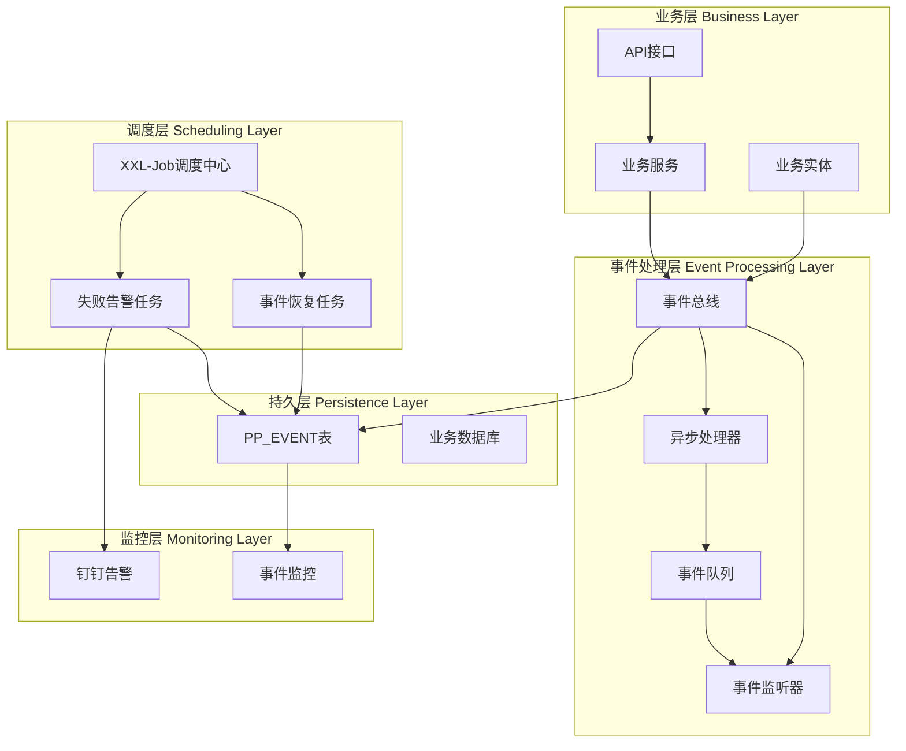
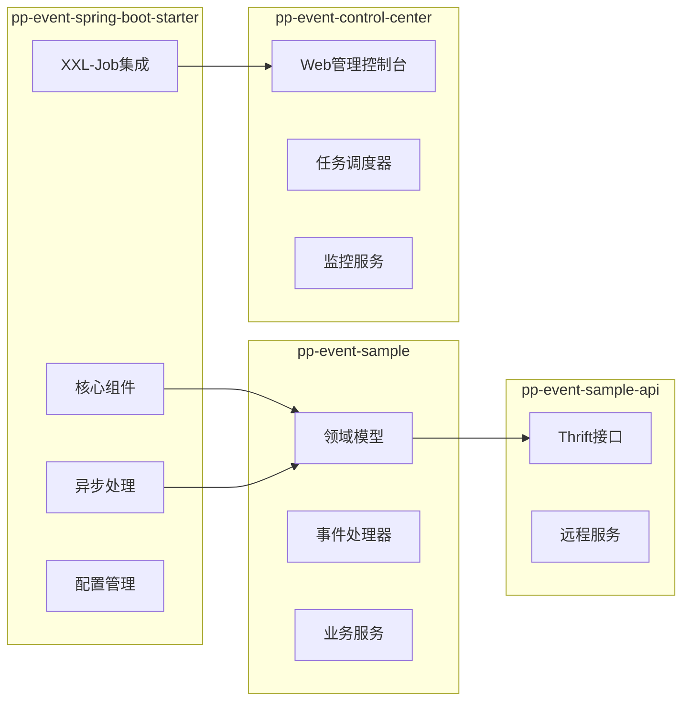
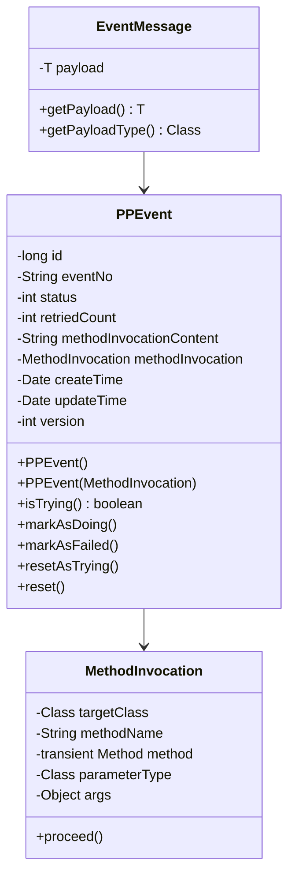
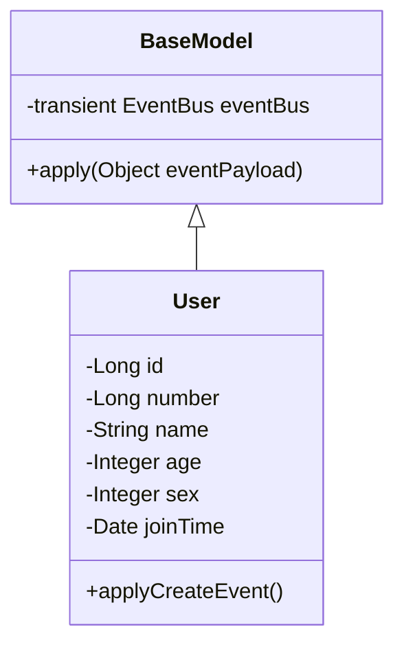
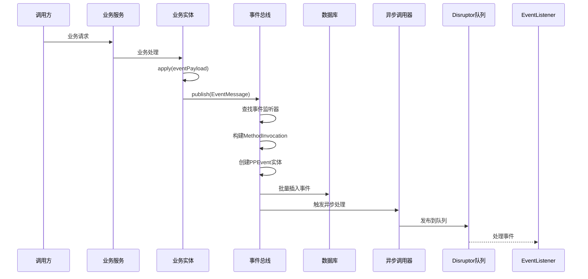
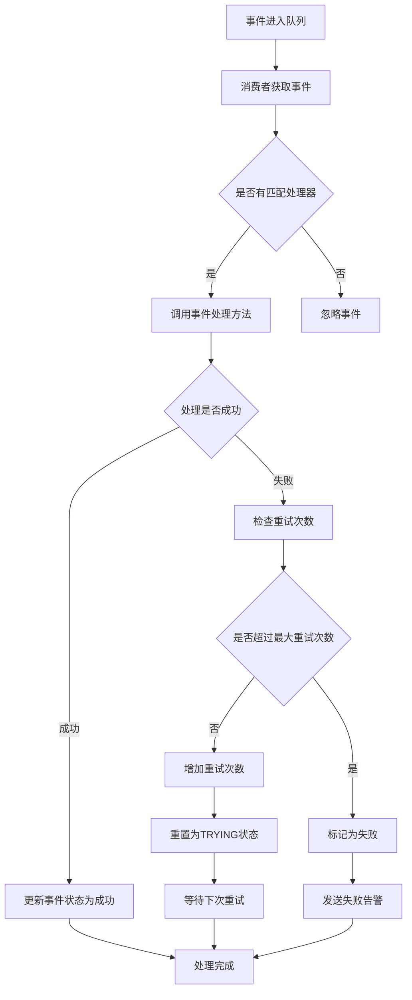
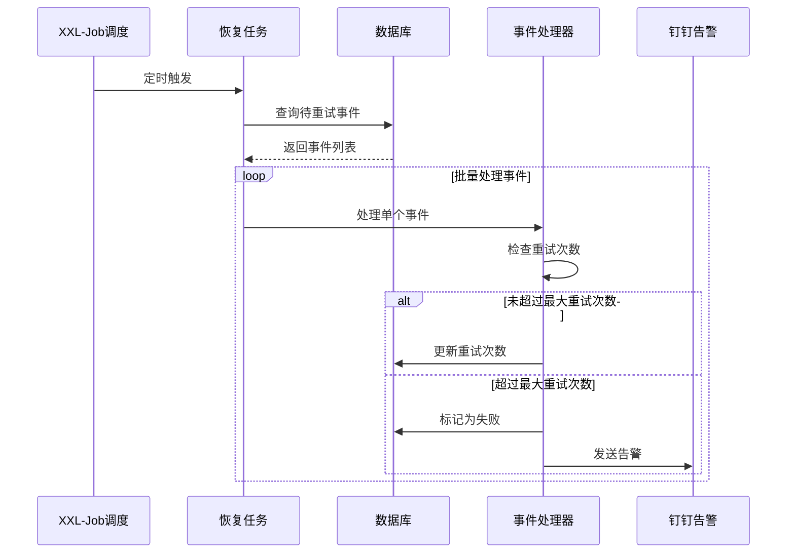
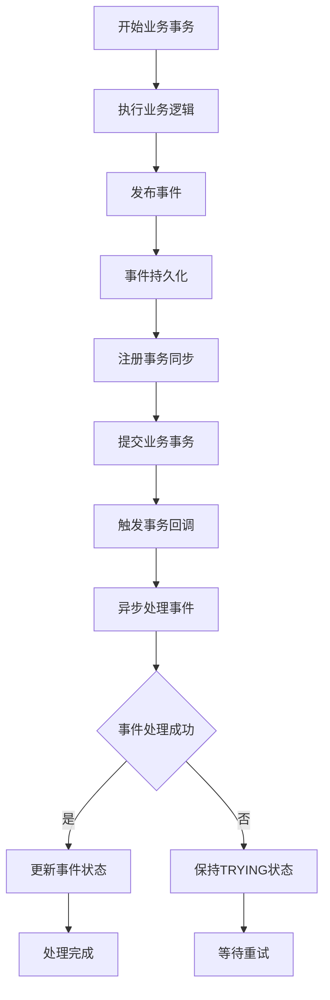

# PP-Event 框架设计文档

## 目录
1. [系统架构](#系统架构)
2. [数据模型](#数据模型)
3. [核心组件](#核心组件)
4. [业务流程](#业务流程)
5. [实现示例](#实现示例)
6. [技术难点分析](#技术难点分析)
7. [面试考察题](#面试考察题)

## 系统架构

### 整体架构概览

PP-Event是一个基于Spring Boot的异步事件框架，采用事件驱动架构（EDA）模式，支持高性能异步事件处理、失败重试机制和分布式任务调度。



### 核心架构特点

1. **事件驱动架构**：基于发布-订阅模式，实现业务逻辑与事件处理的解耦
2. **异步处理**：使用Disruptor高性能队列实现异步事件处理
3. **事务一致性**：事件发布与业务事务在同一事务中，保证数据一致性
4. **失败重试**：集成XXL-Job实现失败事件的自动重试机制
5. **监控告警**：支持钉钉告警，提供实时监控能力

### 模块架构



## 数据模型

### 核心实体模型

#### 1. PPEvent（事件实体）



#### 2. BaseModel（业务实体基类）



### 数据库设计

#### PP_EVENT事件表

| 字段名 | 类型 | 说明 | 索引 |
|--------|------|------|------|
| id | bigint(11) unsigned | 主键ID | PRIMARY |
| event_no | varchar(50) | 事件编号 | INDEX |
| status | int(11) | 事件状态 | INDEX |
| retried_count | int(11) | 重试次数 | INDEX |
| method_invocation_content | varchar(1000) | 方法调用内容 | - |
| create_time | datetime | 创建时间 | INDEX |
| update_time | datetime | 更新时间 | - |
| version | int(11) | 版本号 | - |

#### 事件状态枚举

```java
public enum PPEventStatus {
    TRYING(0,    "处理中"),
    DOING(1,     "执行中"),
    FAILED(2,    "失败");
}
```

#### XXL-Job相关表结构

主要包含：
- `xxl_job_info`: 任务信息表
- `xxl_job_log`: 任务日志表
- `xxl_job_group`: 执行器表
- `xxl_job_registry`: 注册信息表
- `xxl_job_user`: 用户表

## 核心组件

### 1. EventBus（事件总线）

**职责**：
- 事件发布的核心入口
- 管理事件监听器注册
- 构建方法调用和事件实体
- 协调异步处理流程

**核心实现**：
```java
public class EventBus {
    public static final EventBus INSTANCE = new EventBus();
    private final Set<EventListener> listeners = new CopyOnWriteArraySet<>();

    public void publish(EventMessage eventMessage) {
        // 1. 查找匹配的事件监听器
        // 2. 构建PPEvent实体
        // 3. 批量插入数据库
        // 4. 注册事务同步回调
    }
}
```

### 2. AsyncMethodInvoker（异步方法调用器）

**职责**：
- 管理Disruptor生命周期
- 处理事件方法的异步调用
- 处理队列满的情况

**核心特性**：
- 单例模式实现
- 集成Disruptor高性能队列
- 支持线程上下文传递

### 3. EventMethodProcessor（事件方法处理器）

**职责**：
- 处理重试逻辑
- 调用实际的事件处理方法
- 更新事件状态

**重试策略**：
- 最大重试次数可配置
- 超过重试次数标记为失败
- 支持指数退避策略

### 4. XXL-Job集成组件

**EventHandleRecoverJob**：
- 定期扫描待重试事件
- 并发处理重试任务
- 支持峰谷线程池隔离

**FailedEventWarnJob**：
- 扫描失败事件
- 发送钉钉告警
- 支持告警频率控制

## 业务流程

### 1. 事件发布流程



### 2. 异步事件处理流程



### 3. 重试机制流程



### 4. 事务一致性保证



## 实现示例

### 1. 定义事件实体

```java
@Data
@AllArgsConstructor
@NoArgsConstructor
public class UserCreatedEvent implements Serializable {
    private long number;
    private String name;
    private int age;
    private int sex;
}
```

### 2. 创建业务实体

```java
@Data
public class User extends BaseModel {
    private Long id;
    private Long number;
    private String name;
    private Integer age;
    private Integer sex;
    private Date joinTime;

    public void applyCreateEvent() {
        this.apply(new UserCreatedEvent(number, name, age, sex));
    }
}
```

### 3. 实现事件处理器

```java
@Component
@Slf4j
public class UserEventHandler {

    @EventHandler
    public void handleUserCreatedEvent(UserCreatedEvent event) {
        log.info("处理用户创建事件: {}", JSON.toJSONString(event));
        // 异步处理业务逻辑，如发送欢迎邮件、初始化用户数据等
    }

    @EventHandler
    public void handleUserCreatedEvent2(UserCreatedEvent event) {
        log.info("处理用户创建事件2: {}", JSON.toJSONString(event));
        // 另一个独立的业务处理
    }
}
```

### 4. 业务服务使用

```java
@Service
@Transactional
public class UserService {

    @Autowired
    private UserMapper userMapper;

    public void createUser(UserVo userVo) {
        // 1. 创建用户实体
        User user = new User(userVo.getNumber(), userVo.getName(),
                           userVo.getAge(), userVo.getSex());

        // 2. 保存到数据库
        userMapper.insert(user);

        // 3. 发布事件（在事务内）
        user.applyCreateEvent();

        // 事务提交后，事件会自动异步处理
    }
}
```

### 5. 配置文件

```yaml
server:
  port: 8080

spring:
  application:
    name: pp-event-sample

PPEvent:
  pageSize: 100
  retryThreshold: 36
  recoverJobPeriodInSeconds: 30
  failedEventWarnJobPeriodInSeconds: 120
  job:
    author: developer
    group:
      title: 示例应用

xxl:
  job:
    admin:
      addresses: http://localhost:8080/xxl-job-admin
    executor:
      appname: pp-event-sample
      address:
      ip:
      port: 9999
      logpath: /data/applogs/xxl-job/jobhandler
      logretentiondays: 30
    accessToken: default_token
```

## 技术难点分析

### 1. 事务一致性保证

**难点**：如何确保事件发布与业务事务的一致性

**解决方案**：
- 使用Spring的事务同步机制
- 事件在事务提交后才进行异步处理
- 事件持久化与业务操作在同一事务中

```java
TransactionSynchronizationManager.registerSynchronization(new TransactionSynchronization() {
    @Override
    public void afterCommit() {
        // 事务提交后执行异步处理
        AsyncMethodInvoker.getInstance().invoke(methodInvocation, eventId);
    }
});
```

### 2. 高性能异步处理

**难点**：如何实现高性能的事件处理

**解决方案**：
- 采用Disruptor高性能队列
- 无锁化设计，减少线程竞争
- 批量处理机制
- 预分配内存，减少GC压力

### 3. 失败重试机制

**难点**：如何实现可靠的失败重试

**解决方案**：
- 基于数据库状态机的事件状态管理
- 集成XXL-Job实现分布式任务调度
- 支持最大重试次数限制
- 失败告警机制

### 4. 线程上下文传递

**难点**：如何在异步处理中保持线程上下文

**解决方案**：
- 实现ThreadContextSynchronization机制
- 支持峰谷线程池隔离
- 传递TraceId等关键上下文信息

### 5. 监控与运维

**难点**：如何提供完善的监控运维能力

**解决方案**：
- 集成钉钉告警
- 提供Web管理控制台
- 事件处理链路跟踪
- 性能指标监控

### 6. 框架易用性

**难点**：如何降低框架使用门槛

**解决方案**：
- Spring Boot AutoConfiguration自动配置
- 注解驱动的事件处理器注册
- 简洁的API设计
- 完善的文档和示例

## 面试考察题

### 基础题目

#### Q1: 什么是事件驱动架构？PP-Event框架采用了哪些设计模式？

**参考答案**：
事件驱动架构是一种系统架构模式，系统组件之间通过事件进行通信，实现松耦合。PP-Event框架采用的设计模式包括：

1. **观察者模式**：EventBus管理事件监听器的注册和通知
2. **发布-订阅模式**：事件发布者与处理者解耦
3. **单例模式**：AsyncMethodInvoker确保全局唯一实例
4. **模板方法模式**：BaseModel提供事件发布的模板方法
5. **策略模式**：不同的路由策略用于XXL-Job执行器选择
6. **工厂模式**：FactoryBuilder用于创建各种组件实例

#### Q2: PP-Event如何保证事件处理的性能？

**参考答案**：
PP-Event通过多种方式保证性能：

1. **Disruptor高性能队列**：
   - 无锁化设计，避免线程竞争
   - 环形缓冲区，预分配内存
   - 批量处理机制

2. **异步处理**：
   - 事件发布与处理分离
   - 非阻塞式处理
   - 独立的线程池处理

3. **数据库优化**：
   - 批量插入事件记录
   - 合理的索引设计
   - 分页查询避免大结果集

4. **缓存机制**：
   - 事件监听器缓存
   - 方法反射结果缓存

#### Q3: 事件发布失败或处理失败时，框架如何处理？

**参考答案**：
PP-Event采用多层容错机制：

1. **事件发布阶段**：
   - 事件与业务操作在同一事务中
   - 事务失败时事件不会持久化
   - 保证数据一致性

2. **事件处理阶段**：
   - 失败事件保持TRYING状态
   - 通过XXL-Job定时重试
   - 最大重试次数限制
   - 超过重试次数标记为FAILED

3. **告警机制**：
   - FailedEventWarnJob扫描失败事件
   - 发送钉钉告警通知
   - 避免问题积累

### 进阶题目

#### Q4: PP-Event如何解决分布式环境下的事件处理问题？

**参考答案**：
在分布式环境下，PP-Event通过以下方式解决问题：

1. **分布式任务调度**：
   - 集成XXL-Job实现跨节点任务调度
   - 支持任务分片和负载均衡
   - 执行器自动注册和发现

2. **数据库一致性**：
   - 基于数据库的事务特性
   - 乐观锁机制防止并发问题
   - 分布式锁保证任务唯一性

3. **监控和运维**：
   - 集中式管理控制台
   - 实时监控各节点状态
   - 统一的日志和告警

#### Q5: 如何理解PP-Event中的线程上下文传递机制？

**参考答案**：
线程上下文传递是PP-Event的一个重要特性：

1. **问题背景**：
   - 异步处理时线程切换
   - 需要保持TraceId等上下文信息
   - 峰谷线程池隔离需求

2. **实现机制**：
   - ThreadContextSynchronization接口
   - 峰值线程和非峰值线程的上下文隔离
   - 事件处理时的上下文传递

3. **应用场景**：
   - 分布式链路跟踪
   - 用户身份信息传递
   - 业务上下文保持

#### Q6: PP-Event的事件状态机是如何设计的？

**参考答案**：
事件状态机采用经典的状态模式设计：

```java
// 状态转换图
TRYING --事务提交--> DOING --处理成功--> SUCCESS
DOING --处理失败--> TRYING --重试超限--> FAILED
```

1. **状态定义**：
   - TRYING: 待处理状态
   - DOING: 处理中状态
   - FAILED: 失败状态

2. **状态转换**：
   - markAsDoing(): TRYING -> DOING
   - markAsFailed(): 任何状态 -> FAILED
   - resetAsTrying(): DOING -> TRYING (重试)

3. **并发控制**：
   - 版本号机制防止并发修改
   - CAS更新确保状态转换原子性

### 架构设计题目

#### Q7: 如果要你对PP-Event框架进行改进，你会从哪些方面入手？

**参考答案**：
可以从以下几个方面进行改进：

1. **性能优化**：
   - 引入事件批量处理
   - 实现事件优先级机制
   - 优化序列化/反序列化性能

2. **功能增强**：
   - 支持事件调度（定时事件）
   - 事件聚合和去重
   - 支持条件事件处理

3. **可观测性**：
   - 集成OpenTelemetry
   - 事件处理链路跟踪
   - 更丰富的监控指标

4. **易用性提升**：
   - 提供更丰富的注解
   - 支持事件处理器的热部署
   - 可视化事件流程配置

5. **生态集成**：
   - 集成主流消息队列
   - 支持云原生部署
   - 与Spring生态更深度融合

#### Q8: 如何设计一个支持大量事件处理的高性能事件系统？

**参考答案**：
设计高性能事件系统需要考虑：

1. **架构层面**：
   - 分层架构：接入层、处理层、存储层
   - 微服务化：按业务域拆分事件处理
   - 事件网格：支持跨服务事件传递

2. **存储设计**：
   - 事件存储：时序数据库或事件存储
   - 分库分表：按事件类型或时间分片
   - 冷热数据分离

3. **处理策略**：
   - 流式处理：使用Flink或Spark Streaming
   - 批处理：定期批量处理积累事件
   - 混合模式：实时+批处理结合

4. **性能优化**：
   - 无锁数据结构
   - 零拷贝技术
   - 内存池化
   - CPU缓存友好设计

5. **可靠性保证**：
   - 事件溯源
   - CQRS模式
   - 幂等性保证
   - 补偿机制

---

本设计文档详细描述了PP-Event框架的架构设计、实现原理和使用方法，为开发者提供了全面的技术参考。框架通过事件驱动架构实现了业务逻辑的解耦，通过异步处理提升了系统性能，通过重试机制保证了可靠性，是一个生产级的异步事件处理解决方案。