# PP-Event 异步事件框架技术设计方案

## 1. 项目概述

PP-Event是一个基于Spring Boot、MyBatis和XXL-Job的异步事件框架，用于处理业务系统中的异步操作和事件驱动架构。该框架提供了完整的事件发布、存储、异步处理、重试机制和监控管理功能。

### 1.1 核心特性
- **事务一致性**: 事件发布与业务事务强绑定，确保数据一致性
- **异步处理**: 基于Disruptor高性能消息队列实现异步事件处理
- **失败重试**: 集成XXL-Job实现失败事件的自动重试机制
- **监控管理**: 提供完整的事件状态监控和管理界面
- **高可用**: 支持分布式部署和集群管理

### 1.2 模块架构
- **pp-event-spring-boot-starter**: 核心框架模块
- **pp-event-sample**: 示例应用模块
- **pp-event-control-center**: 调度中心管理模块

## 2. 系统架构设计

### 2.1 整体架构图

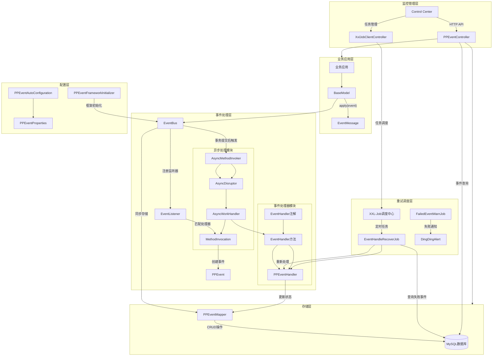

### 2.2 架构说明

该架构采用分层设计，包含以下核心层次：

1. **业务应用层 (BusinessLayer)**:
   - 业务实体继承BaseModel基类
   - 通过apply(event)方法发布EventMessage事件消息
   - 与业务逻辑紧密集成，支持事务一致性

2. **事件处理层 (EventProcessingLayer)**:
   - **EventBus事件总线**: 单例模式，负责事件的订阅、发布和路由
   - **EventListener监听器**: 自动扫描@EventHandler注解，匹配事件处理器
   - **异步处理模块**: AsyncMethodInvoker + AsyncDisruptor实现高性能队列处理
   - **事件处理器模块**: 基于注解的事件处理器注册和执行

3. **存储层 (StorageLayer)**:
   - MySQL数据库持久化存储PP_EVENT事件表
   - PPEventMapper提供CRUD操作
   - 支持事件状态的完整生命周期管理

4. **重试调度层 (RetrySchedulingLayer)**:
   - 集成XXL-Job分布式任务调度中心
   - EventHandleRecoverJob负责失败事件的自动重试
   - FailedEventWarnJob提供失败告警通知机制

5. **监控管理层 (MonitoringLayer)**:
   - Control Center提供统一的管理界面
   - PPEventController提供事件查询和管理API
   - XxlJobClientController管理任务调度

6. **配置层 (ConfigurationLayer)**:
   - PPEventAutoConfiguration自动配置框架组件
   - PPEventProperties管理配置参数
   - PPEventFrameworkInitializer负责框架初始化

### 2.3 核心流程说明

**事件发布流程**:
1. 业务代码调用BaseModel.apply(event)发布事件
2. EventBus接收EventMessage并匹配对应的EventListener
3. 创建MethodInvocation和PPEvent实体
4. 同步存储到数据库，注册事务同步回调
5. 事务提交后触发AsyncMethodInvoker异步处理

**异步处理流程**:
1. AsyncMethodInvoker将事件提交到AsyncDisruptor队列
2. AsyncWorkHandler从队列中消费事件
3. 调用实际的事件处理器方法
4. PPEventHandler更新事件状态并处理结果

**失败重试流程**:
1. XXL-Job定时触发EventHandleRecoverJob
2. 查询超时和失败的事件记录
3. 重新执行事件处理逻辑
4. 超过重试阈值则标记为失败并告警

## 3. 核心类设计

### 3.1 核心类图

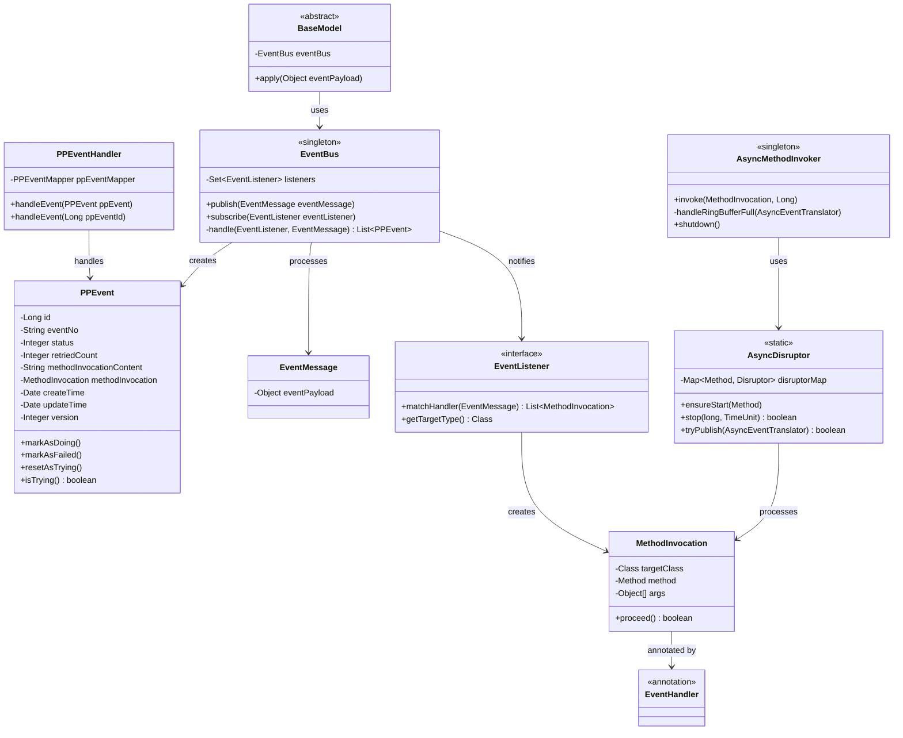

### 3.2 类关系说明

**核心类的职责和关系**:

- **BaseModel**: 所有业务实体的基类，提供事件发布能力
- **EventBus**: 单例事件总线，负责事件的订阅、发布和路由
- **PPEvent**: 事件实体类，包含事件状态、重试次数等元信息
- **EventListener**: 事件监听器接口，负责匹配事件处理器
- **PPEventHandler**: 事件处理器，实际执行事件处理逻辑
- **AsyncMethodInvoker**: 异步方法调用器，将事件提交到Disruptor队列
- **AsyncDisruptor**: 基于LMAX Disruptor的高性能队列实现
- **MethodInvocation**: 方法调用封装，包含目标类、方法和参数
- **EventHandler**: 标注事件处理方法的注解

## 4. 事件处理流程设计

### 4.1 事件发布与处理时序图

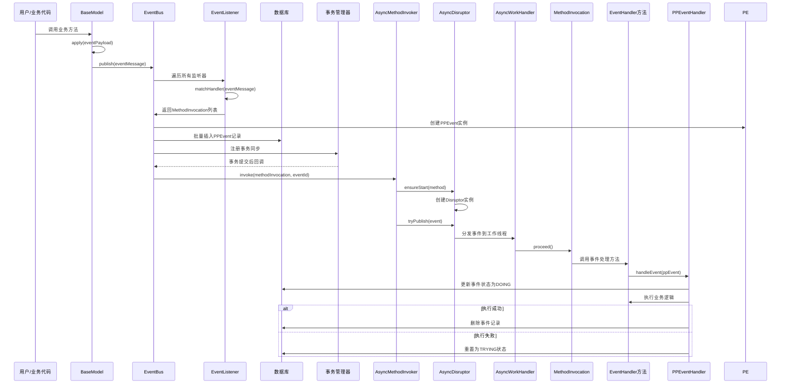

### 4.2 失败重试处理时序图

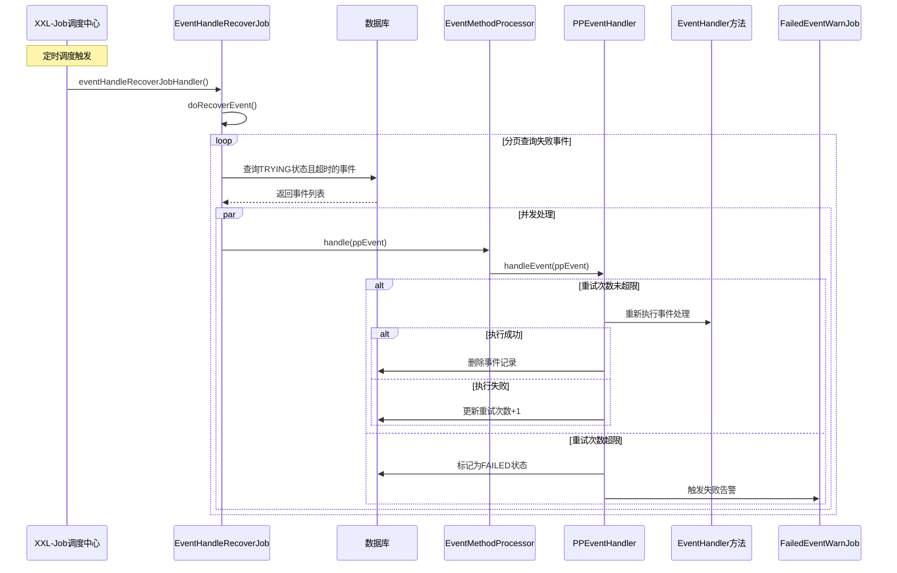

## 5. 数据模型设计

### 5.1 事件状态机

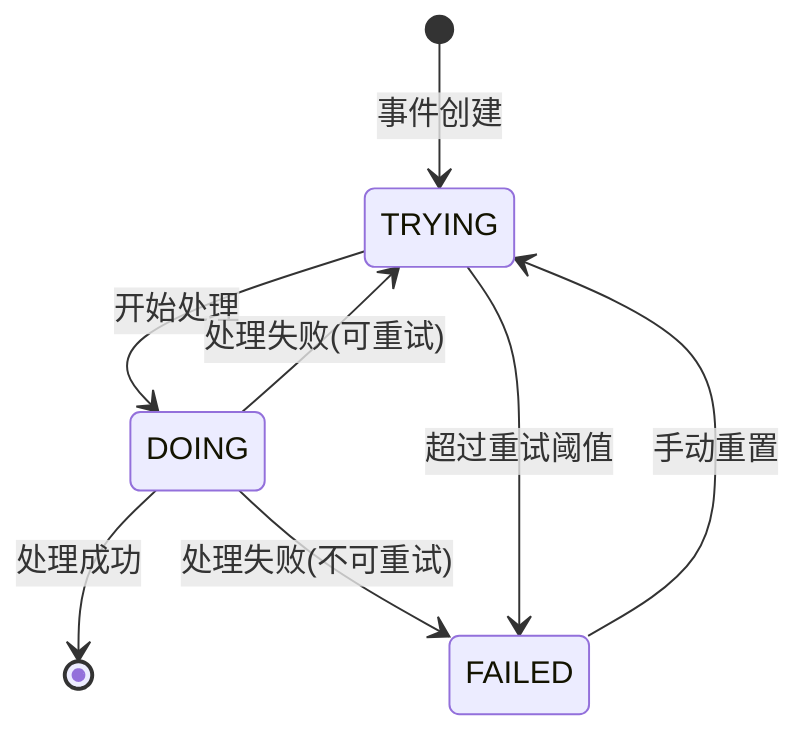

### 5.2 数据库表设计

**PP_EVENT表结构**:
- `id`: 主键，自增长
- `event_no`: 事件唯一编号
- `status`: 事件状态（0-TRYING, 1-DOING, 2-FAILED）
- `retried_count`: 重试次数
- `method_invocation_content`: 方法调用信息(JSON格式)
- `create_time`: 创建时间
- `update_time`: 更新时间
- `version`: 版本号（乐观锁）

## 6. 配置与部署设计

### 6.1 配置参数设计

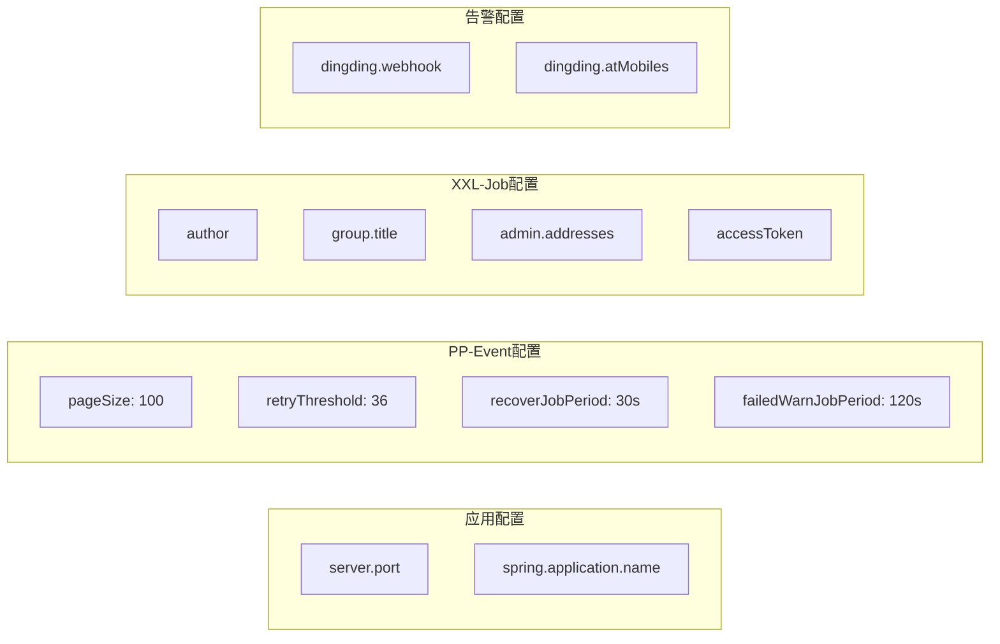

### 6.2 部署架构

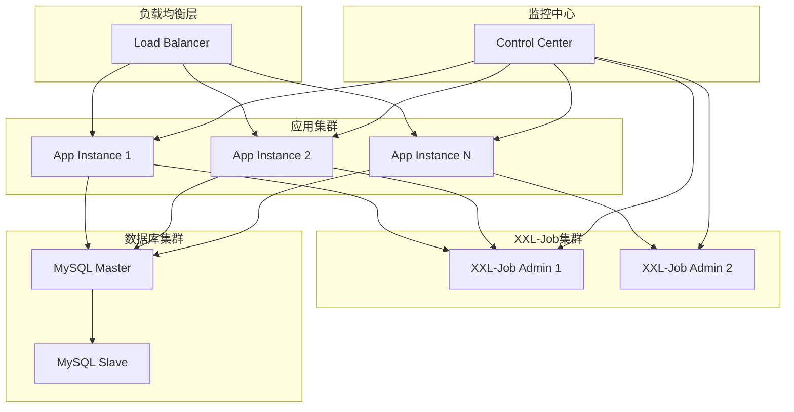

## 7. 性能优化设计

### 7.1 Disruptor高性能队列

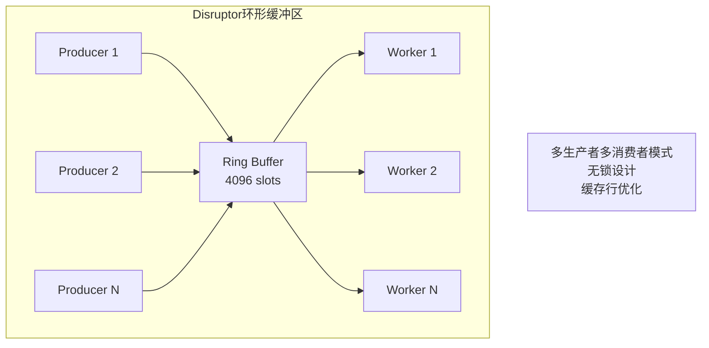

### 7.2 批量处理优化

- **批量插入**: 事件以20条为一批进行数据库插入
- **分页查询**: 重试任务分页查询避免内存溢出
- **并发处理**: 使用线程池并发处理失败事件

## 8. 监控与管理设计

### 8.1 监控指标

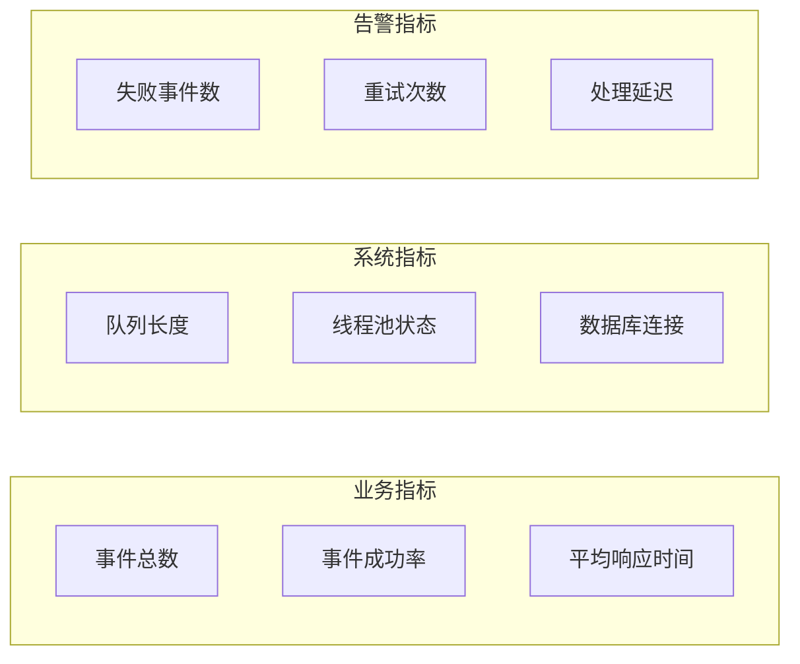

### 8.2 管理功能

- **事件查询**: 支持按应用、状态、时间等条件查询
- **事件重置**: 手动重置失败事件为重试状态
- **事件删除**: 清理不需要的失败事件
- **批量操作**: 支持批量重置和删除操作
- **实时监控**: 实时显示事件处理状态和统计信息

## 9. 异常处理设计

### 9.1 异常处理策略

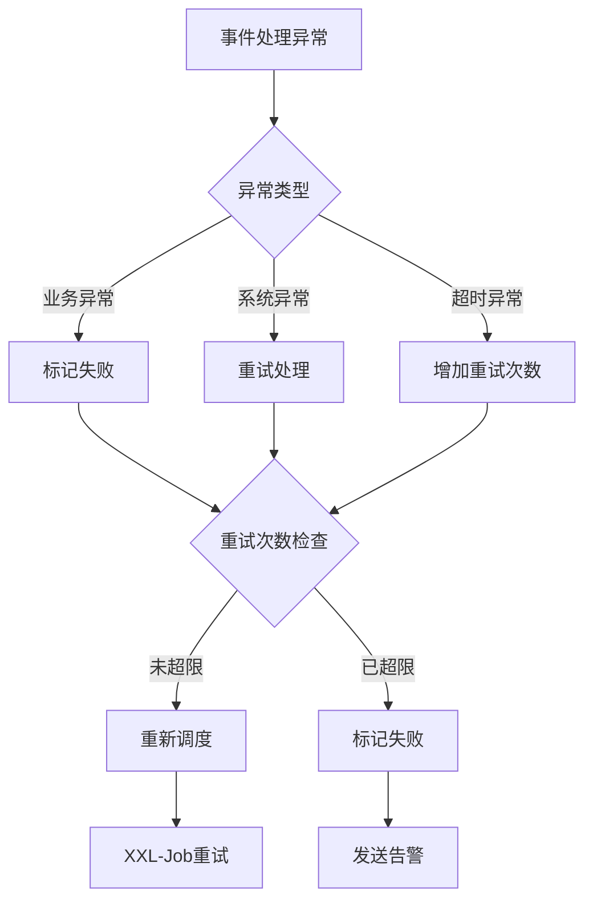

### 9.2 容错机制

- **乐观锁**: 使用version字段防止并发更新冲突
- **幂等性**: 事件处理保证幂等性，支持重复执行
- **降级策略**: 队列满时丢弃事件并记录日志
- **熔断机制**: 连续失败时暂停处理并告警

## 10. 扩展性设计

### 10.1 事件处理器扩展

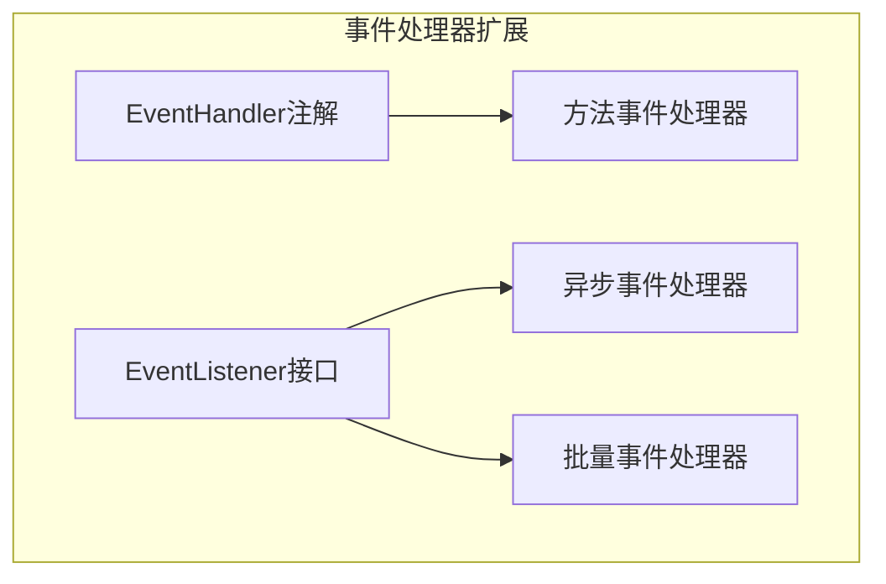

### 10.2 存储扩展

- **存储适配**: 支持不同的数据库存储（MySQL、PostgreSQL等）
- **分库分表**: 支持事件表的水平拆分
- **归档策略**: 支持历史事件的归档和清理

## 11. 安全设计

### 11.1 权限控制

- **访问控制**: Control Center提供用户认证和权限管理
- **API安全**: HTTP接口提供Token认证
- **数据隔离**: 不同应用的事件数据相互隔离

### 11.2 数据安全

- **敏感数据**: 事件数据支持加密存储
- **审计日志**: 记录所有事件操作的审计日志
- **传输安全**: 支持HTTPS传输加密

## 12. 总结

PP-Event框架通过精心设计的架构和实现，提供了高性能、高可用的异步事件处理能力。主要优势包括：

1. **高性能**: 基于Disruptor的无锁队列设计，支持高并发事件处理
2. **一致性**: 事务驱动的发布机制确保事件与业务数据的一致性
3. **可靠性**: 完善的重试机制和异常处理保证事件最终一致性
4. **可观测**: 丰富的监控指标和管理界面支持运维管理
5. **扩展性**: 模块化设计支持功能扩展和定制化需求

该框架适用于需要异步处理、事件驱动架构的业务系统，特别适合订单处理、消息通知、数据同步等场景。